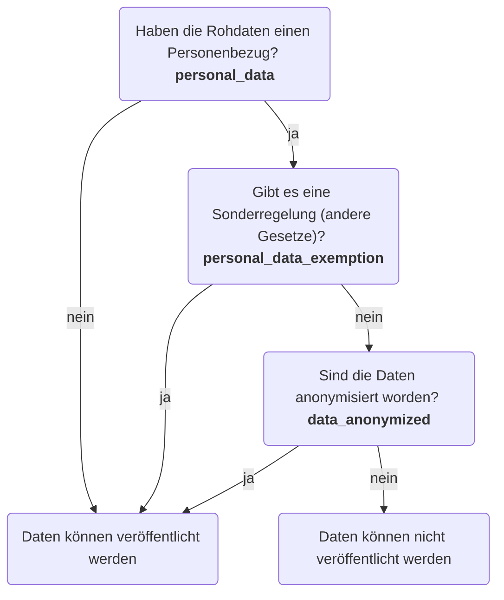

# Personenbezug (Personal Data)

Grundsätzlich dürfen Daten mit Personenbezug nicht veröffentlicht werden, es sei denn sie sind a.) anonymisiert worden oder b.) es gibt ein Gesetz oder eine Sonderregelung, die die Veröffentlichung gestattet (oder vorschreibt).

Dies wird in den Metadaten eines Datensatzes dokumentiert mit den drei Flags `personal_data`, `personal_data_exemption` und `data_anonymized`. Default für alle drei Flags ist `False` / "nein".

## Entscheidungsbaum

## Validierung

Bei der Validierung der drei Flags müssen alle drei als Gruppe berücksichtigt werden.
Folgende Tabelle fasst das zusammen:

<table>
    <thead>
        <tr>
            <th>personal_data</th>
            <th>personal_data_exemption</th>
            <th>data_anonymized</th>
            <th>valide?</th>
            <th>comment</th>
        </tr>
    </thead>
    <tbody>
        <tr>
            <td><strong>F</strong></td>
            <td><strong>F</strong></td>
            <td><strong>F</strong></td>
            <td><strong>T</strong></td>
            <td rowspan="4">Daten ohne Personenbezug unterliegen keiner Sonderregelung und können nicht anonymisiert werden. Bei `personal_data == False` müssen die anderen beiden Flags daher auch `False` sein.</td>
        </tr>
        <tr>
            <td><strong>F</strong></td>
            <td><strong>T</strong></td>
            <td><strong>T</strong></td>
            <td rowspan="3"><strong>F</strong></td>
        </tr>
        <tr>
            <td><strong>F</strong></td>
            <td><strong>F</strong></td>
            <td><strong>T</strong></td>
        </tr>
        <tr>
            <td><strong>F</strong></td>
            <td><strong>T</strong></td>
            <td><strong>F</strong></td>
        </tr>
        <tr>
            <td><strong>T</strong></td>
            <td><strong>T</strong></td>
            <td><strong>T</strong></td>
            <td><strong>F</strong></td>
            <td rowspan="2">Personenbezogene Daten, die auf Grundlage einer Sonderregelung veröffentlicht werden dürfen, müssen/dürfen nicht anonymisiert werden. Also muss `data_anonymized == False` sein.</td>
        </tr>
        <tr>
            <td><strong>T</strong></td>
            <td><strong>T</strong></td>
            <td><strong>F</strong></td>
            <td><strong>T</strong></td>
        </tr>
        <tr>
            <td><strong>T</strong></td>
            <td><strong>F</strong></td>
            <td><strong>T</strong></td>
            <td><strong>T</strong></td>
            <td rowspan="2">Personenbezogene Daten, die keiner Sonderregelung unterliegen, müssen anonymisiert werden. Also muss `data_anonymized == True` sein.</td>
        </tr>
        <tr>
            <td><strong>T</strong></td>
            <td><strong>F</strong></td>
            <td><strong>F</strong></td>
            <td><strong>F</strong></td>
        </tr>
    </tbody>
</table>